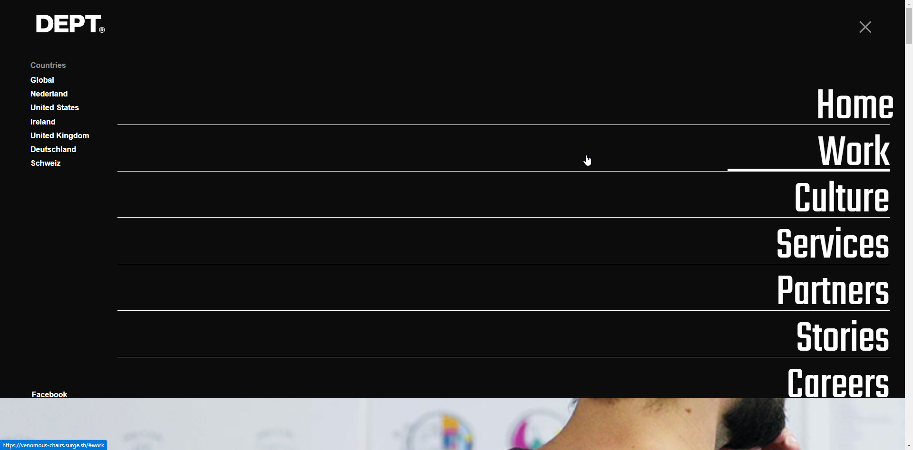
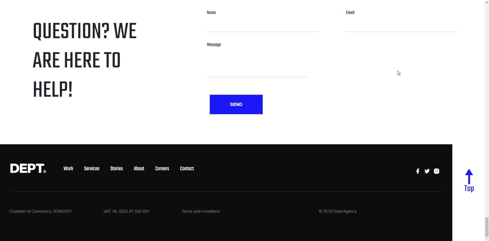
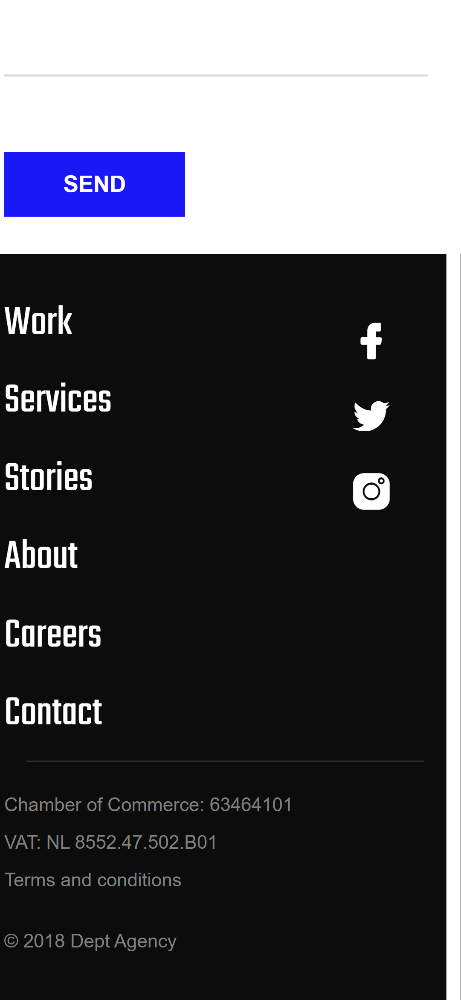

# Frontend Take-home assignment - Dept

My assessment is with a visual focus.

## Authors

- [@Frankie Bukenya](https://www.github.com/frankie-b)

## Demo

https://venomous-chairs.surge.sh/

## Run Locally

Unzip the `fc_frankie_bukenya_react.zip` file and open the folder in VS Code (or whatever editor you use)<br><br>
Go to the project directory hit the `Enter` key

```bash
$ cd frontend-development-assignment-dept
```

```bash
$ cd ./src/
```

Install dependencies

```bash
 $ npm  install
```

Start the dev server

```bash
  npm run dev
```

By defualt the project will open up on `http://localhost:3000/`

## Screenshots








